# Topical Graph Architect (TGA) v4.0.8

> Спецификация скилла для проектирования, аудита и развития семантических коконов как графов сущностей, пользовательских задач, страниц, доказательств и внутренних переходов.

**Topical Graph Architect** — это архитектурный framework для SEO-, контент- и product-команд. Он помогает проектировать не просто набор страниц под ключевые фразы, а управляемую систему пользовательских ответов: с понятной иерархией, семантическими мостами, контролем каннибализации, источниками изменяемых данных и требованиями к качеству.

```text
entity-first + intent-first + graph-first + evidence-led + consistency-first
```

## Зачем нужен TGA

Классический подход к семантическим коконам часто выглядит так:

```text
Pillar page
→ Child pages
→ Internal links
```

TGA использует более полную модель:

```text
Семантический кокон =
граф сущностей
+ пользовательские задачи
+ структурное дерево
+ контекстные переходы
+ evidence/trust/compliance слой
+ SSoT изменяемых фактов
+ контроль качества по роли страницы
+ объяснимые архитектурные решения
```

Скилл полезен, когда нужно:

- спроектировать структуру раздела или сайта с нуля;
- провести аудит существующего контентного кластера;
- устранить каннибализацию страниц;
- определить, где нужна новая страница, а где достаточно раздела;
- построить внутреннюю перелинковку не по ключам, а по пользовательскому пути;
- работать с YMYL- и regulated-нишами;
- управлять меняющимися условиями: ставками, ценами, бонусами, лицензиями, лимитами и eligibility requirements;
- подготовить техническое и редакционное ТЗ для команды.

## Ключевые принципы

### Один структурный дом, несколько смысловых мостов

У каждой страницы есть:

- один `canonical_parent`;
- один путь в URL-структуре;
- один breadcrumb path;
- множество возможных контекстных связей с другими релевантными страницами.

```text
Одна страница = один structural home.
Связи между самостоятельными коконами = bridge.
Bridge ≠ второй parent.
```

### Страница создаётся под задачу, а не под ключ

Новая страница нужна только если одновременно есть:

1. самостоятельный `user_job`;
2. уникальное обещание;
3. отдельная сущность, сценарий или важное ограничение;
4. потребность в собственном наборе доказательств, условий или документов;
5. отсутствие смыслового дубля;
6. роль в пользовательском пути;
7. возможность выполнить role-specific quality baseline.

### Внутренние ссылки создаются ради следующего ответа

TGA не ставит ссылки только потому, что страницы тематически похожи.

Ссылка нужна, когда:

```text
Текущая страница создаёт новую потребность
→ целевая страница даёт следующий необходимый ответ.
```

### Изменяемые факты управляются через SSoT

Для ставок, цен, условий, бонусов, RTP, лицензий и аналогичных данных TGA использует Single Source of Truth.

SSoT учитывает:

```text
field
entity
value
unit
scope
period
conditions
source
owner
verification status
change triggers
```

## Возможности

- **Entity discovery и entity resolution**  
  Выявление сущностей, атрибутов, связей и неоднозначностей.

- **Explicit и latent intent analysis**  
  Разделение прямых пользовательских интентов и скрытых потребностей.

- **Provisional groups и formal clusters**  
  Сначала запросы и latent patterns собираются в предварительные группы, затем формируются устойчивые тематические кластеры.

- **Granularity validation**  
  Решение: новая страница, раздел, support article, bridge, comparison hub, merge или reject.

- **Canonical Home Resolver**  
  Назначение единственного структурного родителя для каждой страницы.

- **Intent-aware anchors**  
  Проектирование анкоров как ответов на конкретный вопрос пользователя.

- **Cannibalization validation**  
  Выявление смысловых дублей по entity, intent, user job, page promise, sections и task outcome.

- **Negative intents**  
  Явное определение того, что страница, кластер или кокон не должны покрывать.

- **SSoT и consistency control**  
  Контроль конфликтов изменяемых фактов с учётом scope, period и conditions.

- **Role-specific Quality Parity**  
  Отдельные критерии качества для всех 14 типов страниц.

- **Vertical compliance layer**  
  Поддержка `gambling`, `ymyl_finance`, `ymyl_medical`, `ymyl_legal`, `other_regulated` и `custom_regulated`.

- **Audit engine**  
  Анализ существующей архитектуры с findings, severity, remediation actions и release blockers.

- **Decision Trace Ledger**  
  Объяснимость решений: почему создана страница, ссылка, bridge, merge или remediation action.

## Режимы работы

| Режим | Когда использовать | Результат |
|---|---|---|
| `quick_assessment` | Нужен быстрый анализ или мало данных | Границы темы, сущности, интенты, риски, запрос данных |
| `full_cocoon_design` | Нужна полная архитектура с нуля | Страницы, URL, связи, SSoT, Quality Parity, backlog |
| `hypothesis_led_design` | Полный дизайн нужен, но данных недостаточно | Архитектурная гипотеза с assumptions и manual review |
| `cocoon_audit` | Уже есть сайт, раздел или кластер URL | Findings, severity, remediation actions, audit readiness |
| `latent_intent_research` | Нужно исследовать скрытый спрос без полного кокона | Latent patterns, candidate destinations, scope risks |

## Архитектурный pipeline

```mermaid
flowchart LR
    A[M01 Input Normalizer] --> B[M02 Mode Router]
    B --> C[M22a Vertical Requirements Injector]
    B --> T[M23a Decision Trace Service]

    C --> D[M03 Topic Boundary]
    C --> E[M17a Audit Context Loader]

    D --> F[M04 Entity Discovery]
    E --> F

    X[M25a External Evidence Intake] --> F
    X --> J
    X --> L
    X --> V
    X --> W

    F --> G[M05 Explicit Intent Mapper]
    G --> H[M26a Topic and Cluster Exclusions]
    H --> I[M06 Latent Intent Engine]
    I --> J[M07 Provisional Latent Intent Aggregator]
    J --> K[M08 Cluster Generator or M08-lite]
    K --> KR[M08 Latent Pattern Reconciliation]
    KR --> L[M09 Granularity Validator]

    L --> M[M10 Complement Decision Engine]
    M --> N[M11 Page Architecture]
    N --> O[M26b Page Negative Intent Assignment]
    O --> P[M12 Canonical Home Resolver]
    P --> Q[M19 SSoT Engine]

    Q --> R[M13 Link Graph Designer]
    R --> S[M14 Intent-Aware Anchor Designer]
    S --> U[M18 Link Context Designer]
    U --> V[M15 Coverage Validator]
    V --> W[M16 Cannibalization Validator]
    W --> Y[M20 Navigation Consistency Validator]
    Y --> Z[M21 Quality Parity Gate]
    Z --> AA[M24 Graph Integrity Validator]
    AA --> AB[M22b Vertical Compliance Validator]
    AB --> AC[M17b Audit Engine]
    AC --> AD[M23b Decision Trace Snapshot]
    AD --> AE[M27 Release Readiness Gate]
    AE --> AF[Output Composer]
```



## Типы страниц

| Тип | Код | Назначение |
|---|---|---|
| Pillar / Hub | `pillar` | Главный вход в тему и навигационный центр |
| Child | `child` | Полный ответ на под-интент |
| Supporting | `supporting` | Узкая деталь, условие, документ или термин |
| Comparison hub | `comparison_hub` | Сравнение альтернатив |
| Support hub | `support_hub` | Центр помощи и сценариев использования |
| Support article | `support_article` | Инструкция, FAQ, troubleshooting |
| Evidence page | `evidence_page` | Методология, расчёт, источник, нормативная база |
| Trust page | `trust_page` | Авторы, политика, контакты, методология |
| Glossary page | `glossary_page` | Объяснение и разграничение терминов |
| Tool page | `tool_page` | Калькулятор, шаблон, интерактивный инструмент |
| Category / Listing | `category_or_listing` | Каталог, подборка или листинг |
| Transactional page | `transactional_page` | Товар, услуга, тариф, заявка |
| Bridge page | `bridge_page` | Явная связка между коконами |
| Compliance page | `compliance_page` | Disclosures, лицензии, ограничения, responsible use |

## Как использовать

### 1. Подключите спецификацию в AI-инструмент

Добавьте файл спецификации в:

- системный prompt;
- custom instructions;
- project instructions;
- knowledge base;
- AI-agent workflow;
- локальный репозиторий с правилами команды.

Для LLM-агента можно использовать раздел **«Системная инструкция TGA v4.0.8»** из полной спецификации как базовую инструкцию.

### 2. Передайте входные данные

Минимальный контракт:

```json
{
  "requested_mode": "full_cocoon_design",
  "main_topic": "IT-ипотека",
  "keywords": [
    "IT-ипотека",
    "условия IT-ипотеки",
    "документы для IT-ипотеки",
    "IT-ипотека для самозанятых"
  ],
  "site_type": "media",
  "language": "ru",
  "region": "RU",
  "strategic_goal": "topical_authority",
  "vertical_profile": "ymyl_finance",
  "regulated_role": "publisher",
  "output_format": "combined"
}
```

### 3. Добавьте данные существующего сайта при аудите

Для `cocoon_audit` желательно передать:

```json
{
  "existing_site_context": {
    "sitemap": [],
    "crawl_data": [],
    "gsc_data": [],
    "existing_pages": [],
    "menu_items": [],
    "breadcrumb_template": null
  }
}
```

Чем больше подтверждённого контекста есть на входе, тем меньше архитектурных допущений будет в результате.

## Пример запроса

```text
Используй Topical Graph Architect v4.0.8.

Режим: full_cocoon_design
Тема: IT-ипотека
Тип сайта: медиа
Язык: русский
Регион: Россия
Vertical profile: ymyl_finance
Regulated role: publisher

Нужно:
1. Построить полную архитектуру кокона.
2. Выделить explicit и latent intents.
3. Создать страницы только при наличии самостоятельного user job.
4. Назначить каждой странице один canonical parent.
5. Сформировать карту внутренней перелинковки.
6. Указать SSoT для изменяемых условий.
7. Подготовить редакционные ТЗ для P0 и P1 страниц.
8. Выдать release readiness и blockers.
```

## Quality gates

TGA использует четыре последовательных уровня готовности.

### Architecture-ready

```text
[ ] Определена topic boundary.
[ ] Выделены основные entities.
[ ] Есть explicit intent map.
[ ] Есть topic-level negative intents.
[ ] Latent patterns имеют confidence.
[ ] Созданы provisional groups и formal clusters.
[ ] Решения о гранулярности имеют decision trace.
[ ] Каждая proposed page имеет role и user job.
[ ] Каждая страница имеет один canonical parent или bridge logic.
```

### Editorial-ready

```text
[ ] У P0/P1 страниц есть user job и unique value proposition.
[ ] Есть required sections.
[ ] Есть evidence requirements.
[ ] Есть freshness policy.
[ ] Есть SSoT dependencies.
[ ] Есть internal link targets.
[ ] Спроектированы anchors и target fragments.
[ ] Пройдена M18 planned validation.
[ ] Есть role-specific quality baseline.
```

### Implementation-ready

```text
[ ] Нет critical SSoT conflicts.
[ ] Нет unresolved critical entity ambiguity.
[ ] URL, breadcrumbs, menu и canonical parent согласованы.
[ ] Нет critical cannibalization.
[ ] P0/P1 страницы проходят Quality Parity.
[ ] Нет critical graph integrity failures.
[ ] Mandatory vertical requirements покрыты.
[ ] Нет unresolved critical manual-review items.
[ ] M27 status = implementation_ready.
```

### Cocoon not ready

```text
[ ] URL созданы только под вариации ключей.
[ ] Pillar состоит из списка ссылок, а не отвечает на главный user job.
[ ] У страницы два structural parents.
[ ] Bridge играет роль второго parent.
[ ] Speculative latent intent стал отдельной страницей.
[ ] Есть критичный SSoT conflict.
[ ] Нет обязательного disclosure.
[ ] P0/P1 страница ниже quality baseline.
[ ] Release status = blocked.
```

## Работа с regulated и YMYL-вертикалями

TGA поддерживает:

```text
gambling
ymyl_finance
ymyl_medical
ymyl_legal
other_regulated
custom_regulated
```

Для таких проектов скилл добавляет:

- mandatory pages;
- conditional pages;
- required disclosures;
- freshness requirements;
- human review domains;
- vertical compliance coverage checks;
- P0 override для непокрытых обязательных требований.

> TGA может спроектировать compliance-архитектуру, но не заменяет юридическую, медицинскую, финансовую или лицензионную проверку.

## Anti-pseudometric guardrail

TGA намеренно не использует SEO-псевдометрики как якобы подтверждённые сигналы Google.

Нельзя утверждать, что следующие термины — подтверждённые факторы Google:

```text
TopicAuthority
LinkValue
TrustScore
Entity Salience
semanticCohesionScore
anchorMatchScore
Q*
T*
P*
midCount
```

Если такие показатели применяются в команде, они должны быть маркированы как:

```text
internal heuristic
non-Google metric
not a confirmed ranking factor
```

## Выходные артефакты

TGA может формировать:

```text
topic boundary
entity graph
entity resolution map
explicit intent map
latent intent map
provisional query groups
formal clusters
negative intent map
granularity decisions
page architecture
canonical home decisions
URL map
breadcrumb map
internal link graph
anchor recommendations
link context checks
SSoT registry
coverage checks
cannibalization risks
navigation checks
Quality Parity checks
Graph Integrity checks
vertical compliance checks
decision ledger
audit findings
implementation backlog
release readiness
editorial briefs
technical specification
```

## Совместимость и миграция JSON

Версия использует:

```json
{
  "skill_version": "4.0.8",
  "schema_version": "4.0.8",
  "compatibility": {
    "min_reader_version": "4.0.2",
    "migration_required_for_strict_validators": true
  }
}
```

Если ваша предыдущая JSON Schema использует:

```json
{
  "additionalProperties": false
}
```

она будет отклонять новые поля TGA v4.0.8. Используйте один из вариантов:

- обновите JSON Schema;
- добавьте version-aware schema routing;
- создайте migration adapter;
- используйте compatibility layer для legacy consumers.

## Структура репозитория

Рекомендуемый вариант:

```text
topical-graph-architect/
├── README.md
├── LICENSE
├── SPECIFICATION.md
├── CHANGELOG.md
├── examples/
│   ├── full-cocoon-design.json
│   ├── cocoon-audit.json
│   ├── latent-intent-research.json
│   └── regulated-gambling-audit.json
├── schemas/
│   ├── tga-v4.0.8-output.schema.json
│   ├── tga-v4.0.8-input.schema.json
│   └── migrations/
│       └── v4.0.7-to-v4.0.8.md
├── templates/
│   ├── editorial-brief.md
│   ├── technical-spec.md
│   └── audit-report.md
└── tests/
    └── regression-suite.md
```


## Лицензия
- `MIT` — для максимально свободного использования;

## Автор

**DrMax**

- Website: https://drmax.su
- Telegram: https://t.me/drmaxseo

---

```text
TGA v4.0.8 — это не генератор URL под ключи.
Это система проектирования объяснимых графов пользовательских задач,
страниц, сущностей, доказательств и переходов.
```
