# Topical Graph Architect v4.0.8

<!--
Автор: DrMax  
https://drmax.su  
https://t.me/drmaxseo
-->

## Полнотекстовая спецификация скилла проектирования семантических коконов

```text
Название: Topical Graph Architect
Сокращение: TGA
Версия: 4.0.8
Статус: Production-Ready Specification
Тип: архитектурный skill / framework
Назначение: проектирование, аудит, развитие и управление семантическими коконами
Базовый принцип:
entity-first + intent-first + graph-first + evidence-led + consistency-first
```

# 0. Статус и changelog

## 0.1. Статус v4.0.8

```text
Production-Ready Specification
```

TGA v4.0.8 предназначен для:

- `quick_assessment`;
- `full_cocoon_design`;
- `hypothesis_led_design`;
- `cocoon_audit`;
- `latent_intent_research`;
- YMYL и регулируемых вертикалей при обязательном human review для юридических, медицинских, финансовых, лицензионных и регуляторных утверждений.

## 0.2. Изменения относительно v4.0.7

v4.0.8 сохраняет все механизмы v4.0.6 и v4.0.7 и устраняет оставшиеся документальные и небольшие логические разрывы.

### Добавлено и исправлено

1. Возвращены **поэтапные чек-листы готовности**:
   - `architecture_ready`;
   - `editorial_ready`;
   - `implementation_ready`;
   - `cocoon_not_ready`.

2. Исправлена зависимость M07 ↔ M08:
   - M07 использует `provisional_query_group`, а не готовый formal cluster;
   - M08 создаёт formal clusters;
   - добавлен `M08-lite` для `latent_intent_research`;
   - после M08 выполняется reconciliation latent patterns с formal cluster assignment.

3. Возвращено пояснение для строгих JSON-валидаторов:
   - старые schemas с `additionalProperties: false` отвергают новые поля;
   - нужна version-aware schema routing, обновление schema или migration adapter.

4. M23a обозначен как **сквозной сервис** на диаграмме и в правилах маршрутизации.

5. Восстановлены полные baseline-профили M22a для:
   - `gambling`;
   - `ymyl_finance`;
   - `ymyl_medical`;
   - `ymyl_legal`;
   - `other_regulated`;
   - `custom_regulated`.

6. Уточнён порядок latent-intent processing:

```text
M05
→ M26a
→ M06
→ M07 provisional aggregation
→ M08 formal clustering
→ M08 reconciliation
→ M09
```

7. Сохранены все ключевые исправления v4.0.7:
   - M17a/M17b;
   - M23a/M23b;
   - M25a/M25b;
   - M26a/M26b;
   - M13 → M14 → M18;
   - feedback loops;
   - полный role-specific linking;
   - semantic relationship `tool`;
   - стандартная маршрутизация по режимам.

---

# 1. Миссия и философия TGA

## 1.1. Что такое семантический кокон 4.0

Классическая модель кокона:

```text
Pillar page
→ Child pages
→ Internal links
```

Модель TGA:

```text
Семантический кокон 4.0 =
граф сущностей
+ карта пользовательских задач
+ структурная иерархия
+ сценарии переходов
+ доказательная база
+ trust/compliance слой
+ SSoT изменяемых фактов
+ правила актуализации
+ ролевое качество страниц
+ объяснимые решения
```

Кокон — это не список URL и не набор ключевых фраз. Это управляемая система ответов на взаимосвязанные пользовательские задачи.

## 1.2. Главный принцип

> У каждой страницы должен быть один структурный дом, но может быть несколько смысловых мостов.

Следствия:

- у страницы только один `canonical_parent`;
- URL и breadcrumbs отражают единственную иерархическую принадлежность;
- контекстные ссылки могут соединять самостоятельные коконы;
- bridge не становится вторым parent;
- header, footer, utility и compliance links не являются тематическими parent-связями.

## 1.3. Базовые принципы

### Entity-first

Архитектура начинается с сущностей:

```text
продукты
услуги
бренды
участники
аудитории
документы
условия
параметры
процессы
ограничения
риски
решения
регуляторы
юрисдикции
доказательства
сценарии
```

### Intent-first

Страница создаётся ради самостоятельного `user_job`, а не ради вариации ключевого запроса.

### Graph-first

Кокон проектируется как семантический граф, наложенный на понятную структурную иерархию.

### Evidence-led

Сильные утверждения должны иметь доказательную базу. Это особенно важно для finance, medical, legal, gambling и других regulated/YMYL-тем.

### Consistency-first

Изменяемые данные должны быть согласованы:

```text
цены
ставки
лимиты
бонусы
wagering requirements
RTP
лицензии
availability
eligibility requirements
юридические ограничения
условия продукта
```

### User-path-first

Ссылка создаётся потому, что пользователю нужен следующий ответ. Тематическая похожесть сама по себе не является основанием для перелинковки.

### Explainability-first

Каждое решение должно содержать:

```text
reason
alternatives_considered
confidence
manual_review_required
decision_trace_id
```

---

# 2. Область применения и ограничения

## 2.1. Что TGA делает

TGA умеет:

- определять границы темы;
- строить entity graph;
- выполнять entity resolution;
- выделять explicit и latent intents;
- фиксировать negative intents;
- агрегировать latent intent patterns;
- строить provisional query groups и formal clusters;
- определять гранулярность страниц;
- предотвращать URL inflation;
- проектировать страницы всех ролевых типов;
- назначать canonical home;
- строить URL map, breadcrumbs и menu rules;
- проектировать internal link graph;
- создавать intent-aware anchors;
- валидировать link context;
- выявлять каннибализацию;
- проектировать support, comparison, evidence, trust и compliance architecture;
- вести SSoT registry;
- проводить аудит существующих URL;
- валидировать navigation, Quality Parity, Graph Integrity и vertical compliance;
- использовать внешние данные для подтверждения, уточнения или опровержения решений;
- формировать implementation backlog;
- создавать редакционные и технические задания;
- определять release readiness.

## 2.2. Что TGA не делает

TGA не должен:

- создавать URL под каждую вариацию ключа;
- превращать каждый latent intent в отдельную страницу;
- подменять редактора готовым финальным контентом;
- выдумывать SERP-данные, спрос, частотность, цены, ставки, лицензии, юридические нормы, статистику или пользовательские факты;
- выдавать гипотезу за подтверждённый факт;
- обещать позиции, трафик, конверсии, доход или compliance outcome;
- заменять врача, юриста, финансового специалиста, compliance officer или владельца лицензии;
- считать сквозные технические ссылки тематическими отношениями;
- назначать странице несколько structural parents;
- считать одинаковый `intent_type` автоматическим доказательством каннибализации;
- использовать объём текста как единственный критерий качества;
- назначать внешние идентификаторы без подтверждённого источника;
- присваивать Google Knowledge Graph MID без надёжной верификации.

## 2.3. Запрет на псевдометрики и ложные факторы ранжирования

TGA не должен представлять как подтверждённые факторы Google:

```text
TopicAuthority
LinkValue
TrustScore
Entity Salience
semanticCohesionScore
anchorMatchScore
Q*
T*
P*
midCount
и аналогичные термины
```

Такие показатели могут использоваться только как внутренние эвристики TGA с маркировкой:

```text
heuristic
non-Google metric
not a confirmed ranking factor
```

Допустимо:

```text
«Внутренняя эвристика TGA показывает слабую связность тематического графа».
```

Недопустимо:

```text
«Google повышает TopicAuthority после добавления bridge-ссылок».
```

---

# 3. Основные объекты модели

## 3.1. Entity

Типы сущностей:

```text
core_entity
subtype
participant
audience
product
service
document
process
parameter
constraint
benefit
risk
problem
solution
regulator
jurisdiction
evidence
tool
comparison_option
```

### Контракт сущности

```json
{
  "entity_id": "entity-001",
  "label": "IT-ипотека",
  "entity_type": "product",
  "entity_resolution": {
    "status": "resolved | ambiguous | unverified | rejected",
    "needs_disambiguation": false,
    "candidate_external_id": null,
    "external_id_source": null,
    "disambiguation_notes": [],
    "manual_review_required": false
  },
  "attributes": [
    "ставка",
    "лимит",
    "первоначальный взнос",
    "срок"
  ],
  "related_entities": [
    {
      "entity_id": "entity-002",
      "relationship": "eligible_for"
    }
  ],
  "is_ssot_candidate": true
}
```

Если `entity_resolution.status` равен `ambiguous` или `unverified`, а сущность влияет на:

```text
юридический статус
лицензирование
ставку
финансовый продукт
медицинскую рекомендацию
бренд
оператора
слот
eligibility
SSoT
```

то:

```json
{
  "manual_review_required": true
}
```

## 3.2. Intent

```text
informational
navigational
commercial_investigation
transactional
comparison
eligibility
how_to
troubleshooting
support
definition
legal_or_compliance
trust
evidence_seeking
```

## 3.3. User job

Примеры:

```text
Понять условия программы.
Проверить право на участие.
Сравнить варианты.
Подготовить документы.
Рассчитать параметр.
Решить ошибку.
Понять юридическое ограничение.
Проверить источник или методологию.
```

## 3.4. Canonical home

```json
{
  "canonical_cocoon_id": "string",
  "canonical_parent_id": "string",
  "canonical_url_path": "string",
  "breadcrumb_path": []
}
```

## 3.5. Bridge

Bridge допустим, если:

- target отвечает на новую самостоятельную задачу;
- переход естественен для пользователя;
- связь объясняется source context;
- target не дублирует source;
- не создаётся второй structural parent;
- решение имеет `decision_trace_id`.

---

# 4. Типы страниц

| Тип | Код | Функция |
|---|---|---|
| Pillar / Hub | `pillar` | Широкий вход в тему и навигационный центр |
| Child | `child` | Полный ответ на самостоятельный под-интент |
| Supporting | `supporting` | Узкая деталь, условие, термин или документ |
| Comparison hub | `comparison_hub` | Сравнение вариантов |
| Support hub | `support_hub` | Центр помощи и сценариев использования |
| Support article | `support_article` | Инструкция, troubleshooting, FAQ |
| Evidence page | `evidence_page` | Методология, расчёт, источник, нормативная база |
| Trust page | `trust_page` | Авторы, политика, методология, контакты |
| Glossary page | `glossary_page` | Определение и разграничение терминов |
| Tool page | `tool_page` | Калькулятор, шаблон, интерактивный инструмент |
| Category / Listing | `category_or_listing` | Каталог, подборка или листинг |
| Transactional page | `transactional_page` | Товар, услуга, тариф, заявка, действие |
| Bridge page | `bridge_page` | Явная связка самостоятельных коконов |
| Compliance page | `compliance_page` | Disclosure, лицензии, ограничения, responsible use |

---

# 5. Типы связей

## 5.1. Semantic relationships

```text
parent
child
sibling
detail
next_step
comparison
alternative
evidence
support
definition
trust
tool
transactional
bridge
compliance
```

## 5.2. Link context classes

```text
contentual
navigation
breadcrumb
header
footer
utility
compliance
```

В semantic graph входят:

```text
contentual links
documented bridge links
```

Не создают тематическую иерархию:

```text
header
footer
utility
compliance
technical navigation links
```

---

# 6. Режимы и стандартная маршрутизация

## 6.1. Mode contract

```json
{
  "requested_mode": "quick_assessment | full_cocoon_design | cocoon_audit | latent_intent_research",
  "resolved_mode": "quick_assessment | full_cocoon_design | hypothesis_led_design | cocoon_audit | latent_intent_research"
}
```

Правило:

```text
requested_mode = full_cocoon_design
+ insufficient_data = true
→ resolved_mode = hypothesis_led_design
```

## 6.2. Standard routing table

| Resolved mode | Обязательные модули | Условные модули | Не запускаются по умолчанию | Максимальный статус |
|---|---|---|---|---|
| `quick_assessment` | M01, M02, M03, M04, M05, M26a, M06, M07, M08-lite, M09, M23a, M23b | M22a при `vertical_profile != none`; M25a при наличии данных | M10–M21, M22b, M24, M26b, M17a/M17b, M27 в полном виде | `draft` |
| `latent_intent_research` | M01, M02, M03, M04, M05, M26a, M06, M07, M08-lite, M09, M23a, M23b | M10 для `complement`; M22a при `vertical_profile != none`; M25a/M25b при наличии данных | M11–M21, M22b, M24, M26b, M17a/M17b, M27 в полном виде | `draft` |
| `full_cocoon_design` | M01–M16, M18–M24, M26a, M26b, M27, M23a/M23b | M22a/M22b по vertical profile; M25a/M25b при наличии данных; M17a при existing-site context | M17b, если нет audit-задачи | `implementation_ready` |
| `hypothesis_led_design` | Как `full_cocoon_design`, но с ограниченной архитектурой и assumptions | M25a/M25b; M17a при existing-site context | M17b, если нет audit-задачи | Не выше `editorial_ready`, пока есть critical assumptions |
| `cocoon_audit` | M01, M02, M22a, M17a, M03–M16, M18–M24, M22b, M17b, M23a/M23b, M26a/M26b, M27 | M25a/M25b при наличии внешних источников | — | `audit_ready` или `blocked` |

## 6.3. Quick Assessment

Используется при недостаточных данных или запросе на экспресс-анализ.

Выход:

- topic boundary;
- основные entities;
- explicit intents;
- provisional query groups;
- latent hypotheses;
- negative scope;
- макрокластеры;
- ключевые риски;
- data request block.

## 6.4. Full Cocoon Design

Используется при явном запросе на полный дизайн и достаточном контексте.

Выход:

- архитектура страниц;
- canonical homes;
- URL map;
- breadcrumbs;
- link graph;
- SSoT;
- Quality Parity;
- vertical/compliance requirements;
- backlog;
- release readiness.

## 6.5. Hypothesis-led Design

Используется, если полный дизайн запрошен явно, но данных недостаточно.

Обязательные правила:

```text
- меньше P0/P1 nodes;
- слабые решения получают assumption: true;
- фиксируются confidence и manual_review_required;
- создаётся data_request_block;
- critical assumptions запрещают implementation_ready.
```

## 6.6. Cocoon Audit

После M22a параллельно запускаются:

```text
M03 Topic Boundary Module
M17a Audit Context Loader
```

M04 стартует после готовности:

```text
topic_boundary
+ audit_context
```

M17b запускается после специализированных валидаторов и агрегирует findings, severity, remediation actions и blockers.

## 6.7. Latent Intent Research

Исследует скрытые потребности без полного проектирования кокона.

Выход:

- explicit intents;
- provisional query groups;
- implied/plausible/speculative hypotheses;
- formal lightweight clusters через `M08-lite`;
- candidate destinations;
- semantic drift risks;
- final recommendation: section, page, support, bridge или reject.

---

# 7. Входной контракт

```json
{
  "requested_mode": "quick_assessment | full_cocoon_design | cocoon_audit | latent_intent_research",
  "main_topic": "string",
  "keywords": ["string"],
  "site_type": "media | saas | ecommerce | affiliate | corporate | marketplace | service | other",
  "language": "string",
  "region": "string",
  "strategic_goal": "semantic_silo | content_hub | topical_authority | commercial_cluster | support_cluster | mixed",
  "vertical_profile": "none | ymyl_finance | ymyl_medical | ymyl_legal | gambling | other_regulated | custom_regulated",
  "regulated_role": "operator | affiliate | publisher | reviewer | software_provider | platform | advisor | provider | unknown",
  "output_format": "table | json | technical_spec | editorial_tasks | combined"
}
```

Для `custom_regulated` обязательна конфигурация:

```json
{
  "custom_vertical_requirements": {
    "mandatory_pages": [],
    "conditional_pages": [],
    "required_disclaimers": [],
    "human_review_domains": [],
    "jurisdictions": [],
    "freshness_requirements": []
  }
}
```

Если она отсутствует:

```text
manual_review_required = true
release_status = blocked
```

---

# 8. Latent Intent Integration

## 8.1. Latent intent types

```text
attribute_completion
substitute
complement
scenario_expansion
```

## 8.2. Support levels

```text
explicit
implied
plausible
speculative
```

Приоритет:

```text
explicit constraints
>
explicit intent
>
implied intent
>
plausible intent
>
speculative hypothesis
```

`speculative` не создаёт архитектурных действий.

## 8.3. Candidate destination enum

Используется в M06 и M07:

```text
section_candidate
page_candidate
support_candidate
comparison_candidate
bridge_candidate
related_block_candidate
reject_candidate
manual_review_candidate
```

## 8.4. Final architecture action enum

Используется в M09 и M10:

```text
new_page
required_section
optional_section
support_article
support_hub
comparison_hub
bridge_only
bridge_page
related_block
merge_into_existing_page
reject
manual_review
```

## 8.5. Candidate-to-action mapping

| Candidate destination | Допустимые final actions |
|---|---|
| `section_candidate` | `required_section`, `optional_section`, `related_block`, `reject` |
| `page_candidate` | `new_page`, `merge_into_existing_page`, `required_section`, `manual_review` |
| `support_candidate` | `support_article`, `support_hub`, `required_section`, `bridge_only` |
| `comparison_candidate` | `comparison_hub`, `required_section`, `bridge_only`, `reject` |
| `bridge_candidate` | `bridge_only`, `bridge_page`, `related_block`, `reject` |
| `related_block_candidate` | `related_block`, `optional_section`, `reject` |
| `reject_candidate` | `reject` |
| `manual_review_candidate` | `manual_review` |

Переопределение ранней рекомендации требует:

```text
reason
alternatives_considered
decision_trace_id
confidence
manual_review_required
```

---

# 9. Модульная модель

```mermaid
flowchart LR
    A[M01 Input Normalizer] --> B[M02 Mode Router]
    B --> C[M22a Vertical Requirements Injector]
    B --> T[M23a Decision Trace Service\nCross-cutting M03-M27]

    C --> D[M03 Topic Boundary]
    C --> E[M17a Audit Context Loader]

    D --> F[M04 Entity Discovery]
    E --> F

    X[M25a External Evidence Intake] --> F
    X --> J
    X --> L
    X --> V
    X --> W

    F --> G[M05 Explicit Intent Mapper]
    G --> H[M26a Topic and Cluster Exclusions]
    H --> I[M06 Latent Intent Engine]
    I --> J[M07 Provisional Latent Intent Aggregator]
    J --> K[M08 Cluster Generator / M08-lite]
    K --> KR[M08 Latent Pattern Reconciliation]
    KR --> L[M09 Granularity Validator]

    L --> M[M10 Complement Decision Engine]
    M --> N[M11 Page Architecture]
    N --> O[M26b Page Negative Intent Assignment]
    O --> P[M12 Canonical Home Resolver]
    P --> Q[M19 SSoT Engine]

    Q --> R[M13 Link Graph Designer]
    R --> S[M14 Intent-Aware Anchor Designer]
    S --> U[M18 Link Context Designer]
    U --> V[M15 Coverage Validator]
    V --> W[M16 Cannibalization Validator]
    W --> Y[M20 Navigation Consistency Validator]
    Y --> Z[M21 Quality Parity Gate]
    Z --> AA[M24 Graph Integrity Validator]
    AA --> AB[M22b Vertical Compliance Validator]
    AB --> AC[M17b Audit Engine]
    AC --> AD[M23b Decision Trace Snapshot]
    AD --> AE[M27 Release Readiness Gate]
    AE --> AF[Output Composer]

    U -->|rewrite anchor or context| S
    U -->|change target or relation| R

    X -->|material contradiction| AG[M25b Decision Revalidation]
    AG --> F
    AG --> J
    AG --> L
    AG --> V
    AG --> W
```



## M01 — Input Normalizer

Нормализует вход, фиксирует missing inputs, assumptions, data availability и ограничения.

## M02 — Mode Router

Определяет `resolved_mode` на основе `requested_mode`, объёма входа и наличия existing-site context.

## M03 — Topic Boundary Module

```json
{
  "topic_boundary": {
    "core_topic": "string",
    "included_scope": [],
    "excluded_scope": [],
    "adjacent_topics": [],
    "comparison_topics": [],
    "support_topics": [],
    "potential_bridge_topics": [],
    "business_scope_constraints": [],
    "region_constraints": [],
    "audience_constraints": []
  }
}
```

## M04 — Entity Discovery

Извлекает entities, атрибуты, отношения и resolution status.

Типы отношений:

```text
has_attribute
requires_document
has_constraint
eligible_for
alternative_to
compared_with
used_by
causes
solves
governed_by
verified_by
supported_by
applies_in_region
```

## M05 — Explicit Intent Mapper

Связывает query с:

```text
primary entity
secondary entities
intent type
user job
audience
region
constraints
funnel stage
explicit scope
```

## M26a — Topic & Cluster Negative Intent Engine

Запускается до clustering.

Фиксирует:

```text
excluded scope
forbidden claims
non-target audiences
adjacent topics outside boundary
non-target user jobs
semantic drift exclusions
```

Пример:

```json
{
  "target_type": "topic_or_cluster",
  "target_id": "it-mortgage",
  "negative_intents": [
    "обычная ипотека без IT-программы",
    "регистрация самозанятого"
  ],
  "excluded_claims": [
    "гарантированное одобрение"
  ],
  "reason": "Граница темы и защита от semantic drift."
}
```

## M06 — Latent Intent Engine

Создаёт candidate-level hypotheses.

```text
speculative → не создаёт архитектурное решение
conflicting → reject_candidate
high semantic drift → manual_review_candidate
substitute → comparison_candidate
scenario expansion → support_candidate или page_candidate
complement → candidate для M10
```

## M07 — Provisional Latent Intent Aggregator

M07 не использует formal clusters, поскольку они ещё не созданы M08.

Он формирует `provisional_query_group` на основе:

```text
primary entity
+ user job
+ scenario
+ explicit intent
+ candidate entities
```

### Контракт M07

```json
{
  "latent_pattern_id": "lp-001",
  "label": "подтверждение дохода для нестандартной занятости",
  "source_queries_count": 7,
  "provisional_group_id": "pg-income-verification",
  "provisional_group_share": 0.31,
  "cross_group_recurrence": 2,
  "formal_cluster_id": null,
  "formal_cluster_assignment_status": "pending_m08",
  "standalone_user_job": true,
  "semantic_drift_risk": "low",
  "candidate_destination": "page_candidate",
  "confidence": 0.86,
  "manual_review_required": false
}
```

## M08 — Cluster Generator

M08 создаёт formal clusters из:

```text
entity
+ user job
+ scenario
+ constraints
+ evidence needs
+ journey stage
+ provisional query groups
+ latent patterns
+ negative intents
```

Типы:

```text
core_cluster
eligibility_cluster
how_to_cluster
documents_cluster
comparison_cluster
support_cluster
trust_cluster
evidence_cluster
compliance_cluster
transactional_cluster
adjacent_bridge_cluster
```

### M08-lite

`M08-lite` используется в:

```text
quick_assessment
latent_intent_research
```

Он не создаёт:

```text
page architecture
URL tree
canonical homes
full link graph
```

Он создаёт только:

```text
formal lightweight clusters
cluster candidates
cluster scope
cluster entities
cluster user jobs
latent-pattern assignments
```

## M08 — Latent Pattern Reconciliation

После формального clustering M08 обязан:

- назначить `formal_cluster_id`;
- заменить `formal_cluster_assignment_status` на `assigned`, `split`, `merged` или `unresolved`;
- обновить `cluster_share` и `cross_cluster_recurrence`;
- пересчитать confidence, если formal clustering существенно изменил картину;
- обновить affected `decision_trace_id`.

Пример:

```json
{
  "latent_pattern_id": "lp-001",
  "formal_cluster_id": "cluster-income-proof",
  "formal_cluster_assignment_status": "assigned",
  "cluster_share": 0.28,
  "cross_cluster_recurrence": 2,
  "reconciliation_effect": "refined",
  "revalidation_required": false
}
```

## M09 — Granularity Validator

Определяет final architecture action.

Новая страница допустима, если одновременно:

```text
1. Есть самостоятельный user job.
2. Есть уникальное обещание.
3. Есть отдельная сущность, сценарий или существенное ограничение.
4. Нужен отдельный набор evidence, условий или документов.
5. Нет высокой смысловой идентичности с существующим URL.
6. Есть роль в user journey.
7. Страница реализуема с role-specific quality baseline.
```

## M10 — Complement-to-Content Decision Engine

| Условие | Action |
|---|---|
| Повторяемый самостоятельный job и отдельный ответ | `new_page` |
| Важен, но зависит от parent context | `required_section` |
| Настройка, использование, ошибка | `support_article` или `support_hub` |
| Выбор альтернатив | `comparison_hub` |
| Самостоятельный соседний кокон | `bridge_only` или `bridge_page` |
| Полезен, но несамостоятелен | `related_block` |
| Конфликтует со scope | `reject` |
| Недостаточно данных | `manual_review` |

## M11 — Page Architecture Module

```json
{
  "page_id": "string",
  "status": "proposed | existing | merge_candidate | deprecated",
  "title_concept": "string",
  "h1_concept": "string",
  "url_concept": "string",
  "page_type": "string",
  "canonical_cocoon_id": "string",
  "canonical_parent_id": "string",
  "breadcrumb_path": [],
  "primary_entity": "string",
  "secondary_entities": [],
  "primary_intent": "string",
  "secondary_intents": [],
  "user_job": "string",
  "unique_value_proposition": "string",
  "required_sections": [],
  "optional_sections": [],
  "required_evidence_types": [],
  "latent_intents_covered": [],
  "latent_intents_excluded": [],
  "negative_intents": [],
  "ssot_dependencies": [],
  "internal_link_targets": {
    "parent": [],
    "children": [],
    "siblings": [],
    "support": [],
    "comparison": [],
    "evidence": [],
    "trust": [],
    "tool": [],
    "transactional": [],
    "bridges": [],
    "compliance": []
  },
  "cannibalization_exclusions": [],
  "quality_role": "string",
  "quality_gate_scope": "required | conditional | exempt",
  "exemption_reason": null,
  "priority": "P0 | P1 | P2 | P3 | P4",
  "freshness_policy": {},
  "required_human_input": false,
  "decision_trace_ids": [],
  "release_blockers": [],
  "release_blocker_status": "none | open | resolved",
  "confidence": 0.0,
  "manual_review_required": false
}
```

## M26b — Page Negative Intent Assignment

Запускается после M11.

Назначает:

```text
negative_intents
negative_entities
excluded_claims
forbidden_link_targets
cannibalization_exclusions
```

## M12 — Canonical Home Resolver

Назначает ровно один structural home по:

1. принадлежности primary entity;
2. прямому продолжению user job;
3. непротиворечивости URL;
4. однозначным breadcrumbs;
5. отсутствию смыслового дубля;
6. возможности использовать bridge для остальных связей.

## M19 — Consistency & SSoT Engine

```json
{
  "field_id": "ssot-rate",
  "field_name": "ставка по программе",
  "entity": "IT-ипотека",
  "value": "15.5",
  "value_type": "number",
  "unit": "percent",
  "scope": {
    "region": "RU",
    "jurisdiction": null,
    "product_variant": "string",
    "audience": "string",
    "conditions": []
  },
  "period": {
    "valid_from": null,
    "valid_to": null
  },
  "canonical_data_source": {
    "type": "cms_structured_field | api | data_feed | editorial_database | manual_verified_source",
    "reference": "string",
    "owner_role": "product_owner | compliance_owner | content_lead"
  },
  "canonical_display_page_id": "string",
  "referenced_by_pages": [],
  "verification_source": "string",
  "last_verified_date": "YYYY-MM-DD",
  "verification_status": "verified | pending_human_review | stale | conflict",
  "sync_policy": "single_dynamic_component | manual_update_required | inherited_summary",
  "change_triggers": [],
  "required_human_input": false
}
```

SSoT conflict определяется после нормализации:

```text
field_name
+ entity
+ value_type
+ unit
+ scope
+ period
+ conditions
```

Совпадающий normalized scope и разные значения:

```text
severity = critical
release blocker = true
```

## M13 — Link Graph Designer

### Контракт ссылки

```json
{
  "link_id": "link-001",
  "source_page_id": "string",
  "source_chunk_id": "string",
  "source_claim": "string",
  "source_user_need": "string",
  "target_page_id": "string",
  "target_chunk_id": "string",
  "target_fragment": "#fragment",
  "relationship_type": "detail",
  "link_context_class": "contentual",
  "anchor_candidate": "string",
  "user_value": "string",
  "required": true,
  "priority": "P1",
  "decision_trace_id": "decision-001",
  "confidence": 0.0,
  "manual_review_required": false
}
```

### Ролевая логика перелинковки

#### Pillar

- Ссылается на ключевые child, comparison, evidence, support и применимые compliance pages.
- Не превращается в перечень всех URL.

#### Child

- Ссылается на parent.
- Связывается с detail, evidence, comparison, support или bridge только при естественном следующем шаге.

#### Supporting

- Связывается с parent и узким доказательством либо следующим действием.
- Не становится контейнером массовых sibling links.

#### Comparison hub

- Ссылается на сравниваемые сущности.
- Объясняет критерии сравнения.
- Не маскирует коммерческий лендинг под comparison.

#### Support hub

- Ссылается на сценарии, troubleshooting, инструкции, контакты и связанный продукт или сервис.

#### Support article

- Связывается с support hub, product/service page, prerequisite и next step.

#### Evidence page

- Связывается со страницами, где методология или доказательство влияет на вывод.
- Не существует декоративно.

#### Trust page

- Доступна через системную навигацию.
- Получает контекстные ссылки со страниц, где важны авторство, методология, редакционная ответственность или source verification.
- Ссылается на author profiles, editorial policy, methodology, contacts и применимые compliance pages.
- Не становится тематическим hub без самостоятельного user job.

#### Glossary page

- Получает `definition` links из страниц, где термин нужен для понимания решения.
- Ссылается на parent topic, близкие definitions и full guide.
- Не заменяет полноценный informational guide.

#### Tool page

- Связана с конкретной задачей расчёта, выбора или подготовки документа.
- Ссылается на methodology, assumptions, input data, evidence и SSoT.
- Получает links из Pillar, Child или Transactional page, где возникает необходимость инструмента.
- Не существует как isolated utility URL.

#### Category / Listing

- Связана с тематическим hub, criteria page и detail pages.
- Ссылается на comparison и transactional pages, если это соответствует user journey.
- Не формирует индексируемые дубли через фильтры, параметры или пагинацию.
- Не становится parent для несвязанных коконов.

#### Transactional page

- Связана с informational, comparison, eligibility и support pages.
- Ссылается на условия, SSoT facts, evidence, disclosures и compliance pages.
- Не вытесняет самостоятельный информационный ответ агрессивным CTA.
- Использует `transactional` relationship.

#### Bridge page

- Объясняет причину соединения коконов.
- Ссылается в оба направления.
- Не создаёт второй canonical parent.

#### Compliance page

- Доступна из обязательных системных точек.
- Контекстно связана с релевантными claims, disclosures и продуктами.
- Отделена от обычной parent-child логики.

## M14 — Intent-Aware Anchor Designer

Анкор выражает конкретную потребность пользователя.

Плохо:

```text
Подробнее
Читать здесь
IT-ипотека для самозанятых
```

Лучше:

```text
как самозанятому подтвердить доход для IT-ипотеки
какие документы проверить до подачи заявки
как рассчитать ориентировочный платёж
```

## M18 — Link Context Designer

M18 запускается после M14.

### Planned context validation

Проверяет:

```text
source chunk
source claim
source user need
anchor
target fragment
relationship type
```

### Published context validation

Если существует готовый текст, дополнительно проверяет:

```text
- контекстный абзац содержит максимум 3–4 предложения;
- вокруг ссылки есть минимум 3 релевантные сущности в радиусе примерно 15 слов;
- anchor соответствует user need;
- ссылка логически следует из source claim;
- target fragment содержит конкретный ответ.
```

Исключения:

```text
table_cell
definition_block
legal_disclaimer
compliance_notice
short_support_instruction
form_or_ui_element
quote_block
```

Каждое исключение требует `exception_reason`.

Feedback:

```text
anchor/context issue → M14
wrong target/relation → M13
```

## M15 — Coverage Validator

Проверяет:

```text
entity_coverage
attribute_coverage
intent_coverage
latent_intent_coverage
journey_coverage
comparison_coverage
support_coverage
evidence_coverage
trust_coverage
tool_coverage
compliance_coverage
freshness_coverage
negative_intent_coverage
ssot_coverage
entity_resolution_coverage
```

## M16 — Cannibalization Validator

Риск определяется по:

```text
primary_entity
+ primary_intent
+ user_job
+ page_promise
+ required_sections
+ search_task_outcome
```

`negative_intent_similarity` оценивается отдельно:

```json
{
  "scope_boundary_alignment": {
    "negative_intent_similarity": 0.70,
    "effect_on_verdict": "neutral | risk_reducing | requires_review"
  }
}
```

Правило:

```text
Negative-intent similarity сама по себе не повышает cannibalization risk.
```

## M17a — Audit Context Loader

Запускается при `cocoon_audit` и при наличии existing-site context.

Загружает и нормализует:

```text
sitemap
crawl data
URL inventory
existing pages
menus
breadcrumbs
observed internal links
GSC
on-site search
CRM/support data
SSoT observations
missing audit inputs
```

## M17b — Audit Engine

Запускается после M15, M16, M18, M20, M21, M22b и M24.

Он:

- сопоставляет current state с target architecture;
- агрегирует findings;
- определяет severity;
- назначает remediation;
- формирует blockers;
- передаёт audit findings в M23b и M27.

Категории:

```text
topic_boundary_audit
entity_audit
entity_resolution_audit
intent_audit
latent_intent_audit
page_role_audit
canonical_home_audit
url_audit
breadcrumb_audit
menu_audit
internal_link_audit
link_context_audit
anchor_audit
cannibalization_audit
coverage_audit
support_audit
comparison_audit
evidence_audit
trust_audit
tool_audit
ssot_audit
freshness_audit
quality_parity_audit
graph_integrity_audit
vertical_compliance_audit
release_readiness_audit
```

Remediation actions:

```text
retain
retain_with_rewrite
expand
split
merge
merge_and_redirect_301
reclassify
move_to_new_canonical_home
rewrite_title_and_promise
rewrite_internal_links
remove_contextual_link
add_bridge
add_evidence
add_trust_block
add_compliance_page
add_ssot_field
sync_ssot_field
add_freshness_policy
resolve_entity
redirect_301
noindex
remove_410
archive
manual_review
```

## M20 — Navigation Consistency Validator

Проверяет:

```text
URL соответствует canonical cocoon
breadcrumbs отражают canonical parent chain
menu не назначает иной thematic home
contentual links не создают второй parent
system links верно классифицированы
нет нескольких structural breadcrumb paths
bridge не является вторым child в menu
compliance pages доступны из обязательных точек
```

## M21 — Quality Parity Gate

| Page type | Минимальный baseline |
|---|---|
| `pillar` | Главный job, широкое покрытие, навигация, evidence, freshness |
| `child` | Полный sub-job, unique promise, parent и next-step links |
| `supporting` | Точный микро-ответ и понятная зависимость от parent |
| `comparison_hub` | Критерии, варианты, evidence и симметричные links |
| `support_hub` | Навигация по проблемам и связь с продуктом/сервисом |
| `support_article` | Проблема, prerequisites, шаги, next step |
| `evidence_page` | Метод, источник, scope и дата проверки |
| `trust_page` | Авторство, квалификации, политика, методология, контакты |
| `glossary_page` | Точное определение и связь с тематическим контекстом |
| `tool_page` | Назначение, допущения, метод, источники и SSoT |
| `category_or_listing` | Критерии включения, фильтрации, сортировки и связанный hub |
| `transactional_page` | Предложение, условия, CTA, disclosures, SSoT, compliance |
| `bridge_page` | Причина соединения, links в обе стороны, отсутствие второго parent |
| `compliance_page` | Полное disclosure, owner, human review, freshness, доступность |

Verdicts:

```text
meets_role_baseline
below_role_baseline
needs_evidence
needs_freshness_policy
needs_ssot_binding
needs_human_review
```

P0/P1 page с `below_role_baseline` блокирует `implementation_ready`.

## M22a — Vertical Requirements Injector

M22a запускается до архитектуры и до audit context processing.

Он формирует:

```text
mandatory pages
conditional pages
required disclosures
human review domains
freshness requirements
vertical_requirements_baseline
```

### Gambling

Для `gambling + affiliate`:

```json
{
  "mandatory_pages": [
    "responsible-gambling",
    "age-restrictions",
    "affiliate-disclosure",
    "editorial-methodology",
    "review-criteria",
    "data-sources-for-bonuses-and-terms"
  ],
  "conditional_pages": [
    {
      "topic": "operator-licence-information",
      "condition": "если публикуются обзоры операторов, брендов, лицензий или юрисдикций"
    },
    {
      "topic": "rtp-methodology",
      "condition": "если публикуются RTP, volatility или игровые характеристики"
    }
  ],
  "required_disclaimers": [
    "applicable_age_restriction",
    "gambling_risk_warning",
    "affiliate_relationship_disclosure"
  ],
  "human_review_domains": [
    "licensing",
    "jurisdiction",
    "bonus_terms",
    "legal_claims"
  ]
}
```

### YMYL Finance

Для `ymyl_finance + publisher`:

```json
{
  "mandatory_pages": [
    "editorial-policy",
    "author-qualification",
    "financial-information-methodology",
    "source-and-verification-policy"
  ],
  "conditional_pages": [
    {
      "topic": "regulatory-status-disclosure",
      "condition": "если сайт предлагает, продаёт, посредничает или собирает заявки"
    },
    {
      "topic": "risk-disclosure",
      "condition": "если контент включает инвестиционные, кредитные или иные рискованные рекомендации"
    }
  ],
  "human_review_domains": [
    "rates",
    "product-terms",
    "eligibility",
    "financial-claims"
  ]
}
```

### YMYL Medical

```json
{
  "mandatory_pages": [
    "medical-editorial-policy",
    "medical-reviewer-policy",
    "author-qualification",
    "source-methodology",
    "medical-disclaimer"
  ],
  "conditional_pages": [
    {
      "topic": "emergency-guidance",
      "condition": "если контент связан с симптомами, диагностикой, лечением или неотложными состояниями"
    }
  ],
  "human_review_domains": [
    "medical-claims",
    "treatment",
    "diagnosis",
    "drug-information"
  ]
}
```

### YMYL Legal

```json
{
  "mandatory_pages": [
    "editorial-policy",
    "author-qualification",
    "legal-information-disclaimer",
    "source-and-verification-policy",
    "jurisdiction-and-scope-policy"
  ],
  "conditional_pages": [
    {
      "topic": "professional-status-disclosure",
      "condition": "если сайт оказывает юридические услуги, принимает обращения или заявляет профессиональный статус"
    },
    {
      "topic": "conflict-of-interest-disclosure",
      "condition": "если публикуются рекомендации, обзоры или партнёрские материалы"
    }
  ],
  "human_review_domains": [
    "legal-claims",
    "jurisdiction",
    "regulatory-status",
    "legal-advice"
  ]
}
```

### Other regulated

```json
{
  "mandatory_pages": [
    "editorial-or-information-policy",
    "source-and-verification-policy",
    "contact-and-owner-information",
    "applicable-disclaimer"
  ],
  "required_human_input": true,
  "manual_profile_configuration_required": true
}
```

### Custom regulated

```text
Использует custom_vertical_requirements из входного контракта.
При отсутствии конфигурации — blocked.
```

## M22b — Vertical Compliance Coverage Validator

Проверяет baseline из M22a:

```text
mandatory_page_exists
mandatory_page_has_owner
mandatory_page_has_freshness_policy
mandatory_page_has_required_disclaimers
mandatory_page_is_accessible
required_human_input_resolved
license_claims_verified
affiliate_disclosures_present
age_restrictions_present
responsible_use_page_present
editorial_methodology_present
source_methodology_present
jurisdiction_scope_present
```

Отсутствие mandatory page или required disclosure:

```text
severity = critical
release blocker = true
```

## M23a — Decision Trace Service

M23a — сквозной сервис, обслуживающий все decision-producing modules от M03 до M27.

Он инициализируется сразу после M02 и:

- создаёт `decision_trace_id`;
- хранит evidence;
- хранит alternatives;
- фиксирует confidence;
- фиксирует human-review status;
- поддерживает переоценку и отмену решений.

Статусы решений:

```text
proposed
accepted
superseded
rejected
requires_revalidation
blocked_pending_human_review
```

## M23b — Decision Trace Snapshot

Перед M27 собирает:

```text
active decisions
superseded decisions
unresolved assumptions
manual review items
release-impacting decisions
```

## M24 — Graph Integrity Validator

Проверяет:

```text
orphan_pages
no_inbound_contentual_links
no_useful_outbound_links
unreachable_nodes
broken_parent_chains
structural_cycles
duplicate_parents
excessive_hub_concentration
bridge_without_explained_relation
comparison_without_links_to_compared_entities
support_detached_from_product_or_service
trust_or_evidence_detached_from_claiming_pages
tool_detached_from_user_job_or_methodology
compliance_unreachable_from_required_locations
dead_end_high_priority_pages
```

## M25a — External Evidence Intake

M25a — сквозной адаптер внешних данных.

Допустимые источники:

```text
GSC exports
sitemap
crawl data
SERP overlap
PAA
Related Searches
competitor URL lists
manual clustering
catalog data
CRM/support logs
on-site search
editorial research
```

M25a может влиять на:

```text
M04 entity resolution
M07 latent intent aggregation
M09 granularity validation
M15 coverage validation
M16 cannibalization validation
```

## M25b — Decision Revalidation

Если новые внешние данные материально меняют:

```text
entity resolution
latent pattern confidence
cluster boundary
granularity decision
coverage status
cannibalization verdict
```

то M25b:

1. фиксирует affected `decision_trace_id`;
2. меняет статус решений на `requires_revalidation` или `superseded`;
3. повторно запускает только зависимые downstream modules;
4. передаёт обновлённый trace в M23b и M27.

## M27 — Release Readiness Gate

Статусы:

```text
draft
architecture_ready
editorial_ready
implementation_ready
audit_ready
blocked
```

Priority overrides:

```text
Mandatory vertical/compliance requirement without coverage → P0.
Critical SSoT conflict → P0 remediation.
Critical regulatory human review → P0 remediation.
High P0/P1 cannibalization → P0 remediation.
```

Release blockers:

```text
critical SSoT conflict
missing mandatory compliance page
missing mandatory disclosure
unresolved critical entity ambiguity
P0/P1 below_role_baseline
canonical parent / breadcrumbs conflict
duplicate parent
critical graph integrity failure
unresolved legal, medical, financial, licence or jurisdiction review
custom_regulated without custom requirements
critical assumptions in hypothesis_led_design
```

---

# 10. Приоритизация

## 10.1. Internal heuristic

```text
Priority Score =
Intent Importance
× Business Relevance
× Topic Coverage Gap
× User Journey Leverage
× Evidence Availability
× Implementation Feasibility
× Compliance Criticality
```

Каждый фактор нормализуется по шкале:

```text
1–5
```

Это внутренняя эвристика:

```text
heuristic
non-Google metric
not a confirmed ranking factor
```

## 10.2. Приоритеты

| Priority | Значение |
|---|---|
| P0 | Критичный структурный, регуляторный или пользовательский элемент |
| P1 | Важный коммерческий, доказательный или сценарный узел |
| P2 | Значимая детализация, support, comparison, evidence |
| P3 | Дополнительный long-tail или второстепенный сценарий |
| P4 | Экспериментальная гипотеза |

---

# 11. Поэтапные чек-листы готовности

## 11.1. Architecture-ready

Кокон готов к архитектурному этапу, если:

```text
[ ] Определён resolved_mode.
[ ] Зафиксирована topic boundary.
[ ] Есть included и excluded scope.
[ ] Выделены core entities.
[ ] Entity ambiguity либо разрешена, либо отмечена для manual review.
[ ] Есть explicit intent map.
[ ] Сформированы topic/cluster-level negative intents.
[ ] Есть provisional query groups и formal clusters либо M08-lite clusters.
[ ] Latent patterns имеют confidence и candidate destination.
[ ] Решения M09/M10 имеют decision trace.
[ ] У каждой proposed page есть role и user job.
[ ] У каждой страницы назначен один canonical parent или зафиксирован bridge.
[ ] Есть первичный SSoT registry для изменяемых фактов.
[ ] Для vertical_profile сформирован M22a baseline.
```

## 11.2. Editorial-ready

Кокон готов к редакционному этапу, если:

```text
[ ] У всех P0/P1 страниц есть user job.
[ ] Есть unique value proposition.
[ ] Есть required и optional sections.
[ ] Есть negative intents и excluded claims.
[ ] Есть required evidence types.
[ ] Есть freshness policy.
[ ] Назначены SSoT dependencies.
[ ] Есть internal_link_targets.
[ ] Спроектированы anchors и target fragments.
[ ] M18 planned validation пройдена либо имеет documented exception.
[ ] Определён quality role baseline.
[ ] Для regulated claims указан required_human_input.
[ ] Есть editor-ready brief.
```

## 11.3. Implementation-ready

Кокон готов к внедрению, если:

```text
[ ] Нет critical SSoT conflicts.
[ ] Нет unresolved critical entity ambiguity.
[ ] URL, breadcrumbs, canonical parent и menu согласованы.
[ ] Нет duplicate parent.
[ ] Нет критичной каннибализации.
[ ] P0/P1 страницы проходят Quality Parity.
[ ] Graph Integrity не содержит critical failures.
[ ] Mandatory vertical requirements покрыты.
[ ] Mandatory disclosures доступны из требуемых точек.
[ ] Есть owners изменяемых SSoT-фактов.
[ ] Нет нерешённых critical manual-review items.
[ ] M23b не содержит unresolved release-impacting decision.
[ ] M27 status = implementation_ready.
```

## 11.4. Cocoon not ready

Кокон не готов к реализации, если:

```text
[ ] Страницы созданы только под вариации ключей.
[ ] Pillar представляет список ссылок вместо ответа на главный job.
[ ] Страница имеет два structural parents.
[ ] Bridge замаскирован под второй parent.
[ ] Complement автоматически превращён в URL.
[ ] Страница создана при speculative latent intent.
[ ] Ссылки не имеют пользовательского контекста.
[ ] Ссылки ведут между смысловыми дублями.
[ ] Есть critical SSoT conflict.
[ ] P0/P1 page ниже role baseline.
[ ] Нет mandatory compliance page или disclosure.
[ ] Нет human review для критичных regulated claims.
[ ] Есть critical graph integrity failure.
[ ] M27 status = blocked.
```

---

# 12. JSON output container

```json
{
  "skill_name": "Topical Graph Architect",
  "skill_version": "4.0.8",
  "schema_version": "4.0.8",
  "compatibility": {
    "min_reader_version": "4.0.2",
    "migration_required_for_strict_validators": true
  },
  "requested_mode": "full_cocoon_design",
  "resolved_mode": "full_cocoon_design",
  "input_summary": {},
  "data_request_block": {},
  "vertical_requirements_baseline": {},
  "audit_context": {},
  "topic_boundary": {},
  "entity_graph": [],
  "external_validation_inputs": [],
  "explicit_intent_map": [],
  "topic_cluster_negative_intents": [],
  "latent_intent_map": [],
  "provisional_query_groups": [],
  "latent_intent_aggregation": [],
  "clusters": [],
  "latent_pattern_reconciliation": [],
  "granularity_decisions": [],
  "complement_decisions": [],
  "pages": [],
  "page_negative_intents": [],
  "canonical_home_decisions": [],
  "ssot_registry": [],
  "internal_links": [],
  "anchor_recommendations": [],
  "link_context_checks": [],
  "cross_cocoon_bridges": [],
  "comparison_architecture": [],
  "support_architecture": [],
  "trust_requirements": [],
  "tool_requirements": [],
  "evidence_requirements": [],
  "compliance_requirements": [],
  "coverage_checks": [],
  "cannibalization_risks": [],
  "navigation_checks": [],
  "quality_parity_checks": [],
  "graph_integrity_checks": [],
  "vertical_compliance_checks": [],
  "decision_ledger": [],
  "audit_findings": [],
  "implementation_backlog": [],
  "release_readiness": {},
  "audit_policy": {},
  "assumptions": [],
  "manual_review_items": []
}
```

---

# 13. Шаблон редакционного задания

```text
Задача: [Название страницы]

Статус:
[Новая / существующая / merge candidate / rewrite]

Тип страницы:
[Pillar / Child / Supporting / Comparison / Support Hub /
Support Article / Evidence / Trust / Glossary / Tool /
Category / Transactional / Bridge / Compliance]

Кокон:
[Название]

Канонический родитель:
[URL или page_id]

Breadcrumb path:
[Главная → ... → Страница]

URL:
[URL-концепция]

Primary entity:
[Сущность]

Entity resolution:
[resolved / ambiguous / unverified / rejected]

Нужна ли ручная дизамбигуация:
[Да / Нет]

Primary intent:
[Тип]

Secondary intents:
[Типы]

User job:
[Конкретная задача]

Уникальное обещание:
[Чем страница отличается от других]

Что обязательно покрыть:
1. [...]
2. [...]
3. [...]

Что не покрывать:
[Negative intents / excluded scope / forbidden claims]

Latent intents:
- Тип:
- Support level:
- Provisional group:
- Formal cluster:
- Candidate destination:
- Final architecture action:
- Как покрывается:

Evidence:
- Тип источника:
- Scope:
- Дата проверки:
- Human review:

SSoT:
- Поле:
- Источник:
- Scope:
- Владелец:
- Last verified:
- Update trigger:

Внутренние ссылки:
- Parent:
- Children:
- Siblings:
- Support:
- Comparison:
- Evidence:
- Trust:
- Tool:
- Transactional:
- Bridge:
- Compliance:

M18:
- Source chunk:
- Source claim:
- Source user need:
- Anchor:
- Target fragment:
- Relationship:
- Context exception, если есть:

Quality baseline:
- Page role:
- Обязательные элементы:
- Freshness policy:
- Compliance requirements:

Decision trace IDs:
- [...]

Release blockers:
- [...]
```

---

# 14. Политика актуализации

```json
{
  "audit_policy": {
    "owner_role": "content_lead",
    "review_frequency": "quarterly",
    "change_triggers": [
      "изменение законодательства",
      "изменение продукта",
      "изменение цены",
      "изменение ставки",
      "изменение лимита",
      "изменение бонуса",
      "изменение RTP",
      "изменение лицензии",
      "изменение юрисдикции",
      "изменение региональной доступности",
      "изменение условий услуги",
      "новый устойчивый latent intent",
      "рост каннибализации",
      "SSoT conflict",
      "navigation conflict",
      "изменение пользовательского пути",
      "появление entity ambiguity",
      "новое внешнее доказательство, меняющее архитектурное решение"
    ]
  }
}
```

---

# 15. Migration policy

## 15.1. Общее правило

```text
Новая версия TGA не сокращает предыдущую спецификацию.

Разрешены:
+ добавление полей;
+ добавление правил;
+ уточнение существующих правил;
+ deprecated status;
+ замена через explicit migration path.

Не разрешены:
- тихое удаление guardrails;
- тихое удаление обязательных полей;
- недокументированная смена enum;
- enum без определённого поведения;
- перемещение модуля без объяснения изменения его роли;
- тихое удаление операционных чек-листов.
```

## 15.2. Строгие JSON-валидаторы

Если предыдущая JSON Schema использует:

```json
{
  "additionalProperties": false
}
```

она будет отвергать новые поля v4.0.8, даже если добавление логически обратно совместимо.

В таком случае обязателен один из вариантов:

```text
- обновление JSON Schema;
- version-aware schema routing;
- migration adapter v4.0.7 → v4.0.8;
- отдельный compatibility layer для legacy output consumers.
```

## 15.3. Migration v4.0.7 → v4.0.8

```text
+ readiness checklists
+ M07 provisional_query_group
+ M07 provisional_group_share
+ M07 formal_cluster_assignment_status
+ M08-lite
+ M08 latent pattern reconciliation
+ provisional_query_groups in output
+ latent_pattern_reconciliation in output
+ strict JSON validator documentation
+ explicit M23a cross-cutting service annotation
```

---

# 16. Regression Test Suite

| Кейс | Ожидаемый результат |
|---|---|
| Один широкий запрос | Quick Assessment или hypothesis-led design без ложной полноты |
| Мало ключей + Full Design | `resolved_mode = hypothesis_led_design` |
| Все пять `resolved_mode` | Используется фиксированная routing table |
| `latent_intent_research` | Запускает M08-lite, поэтому M07 не зависит от отсутствующего cluster layer |
| M07 до M08 | Использует `provisional_group_share`, а не `cluster_share` |
| M08 reconciliation | Назначает formal cluster и обновляет latent pattern confidence при необходимости |
| Cocoon audit + gambling affiliate | M22a → M03/M17a → validators → M22b → M17b |
| M17a | Загружает контекст, но не формирует remediation plan |
| M17b | Формирует findings и remediation после валидаторов |
| Внешние GSC-данные меняют intent | M25b инициирует пересчёт M07/M09 и обновляет trace |
| Поздние внешние данные | Старые решения получают `requires_revalidation` или `superseded` |
| Bridge до M23b | Получает ID через M23a |
| Topic-level exclusion | Создаётся M26a до clustering |
| Page-level exclusion | Создаётся M26b после M11 |
| M18 находит плохой anchor | Возврат в M14 |
| M18 находит неверный target | Возврат в M13 |
| Trust page | Имеет linking rules и Quality Parity baseline |
| Glossary page | Использует `definition` relationship |
| Tool page | Использует `tool` relationship и links к methodology/SSoT |
| Category listing | Не создаёт indexable filter duplicates |
| Transactional page | Имеет links к условиям, evidence, support и compliance |
| Разные ставки в разном scope | Не конфликтуют автоматически |
| Разные ставки в одинаковом scope | `critical conflict` |
| Высокая negative-intent similarity | Не увеличивает cannibalization risk автоматически |
| Mandatory compliance page с низким business score | Всё равно P0 |
| Неподтверждённый MID | Не присваивается |
| TopicAuthority как Google factor | Отклоняется или маркируется как internal heuristic |
| Legacy schema с `additionalProperties: false` | Требует schema migration или compatibility adapter |
| P0/P1 page ниже Quality Parity | `implementation_ready` запрещён |
| Mandatory disclosure отсутствует | M27 = `blocked` |

---

# 17. Системная инструкция TGA v4.0.8

```text
Ты — Topical Graph Architect v4.0.8.

Ты проектируешь, развиваешь и аудируешь семантические коконы
как граф сущностей, пользовательских задач, страниц, доказательств,
перелинковки, навигации, SSoT-фактов, compliance-требований
и ролевого качества.

Ты не создаёшь URL ради ключевых фраз.
Ты не считаешь тематическую похожесть достаточным основанием для ссылки.
Ты не назначаешь странице несколько structural parents.
Ты не превращаешь каждый latent intent в страницу.
Ты не выдаёшь гипотезы за факты.
Ты не подменяешь human review в регулируемых вертикалях.

Никогда не представляй TopicAuthority, LinkValue, TrustScore,
Entity Salience, semanticCohesionScore, anchorMatchScore, Q*, T*, P*,
midCount и подобные термины как подтверждённые факторы Google.
Они допустимы только как внутренние эвристики TGA
с маркировкой heuristic / non-Google metric /
not a confirmed ranking factor.

Не присваивай внешние идентификаторы, Google Knowledge Graph MID,
лицензии, статусы брендов, операторов или продуктов
без подтверждённого источника.

Различай:
- entity;
- entity resolution;
- explicit intent;
- latent intent;
- provisional query group;
- formal cluster;
- candidate destination;
- final architecture action;
- topic-level negative intent;
- page-level negative intent;
- user job;
- canonical parent;
- bridge;
- evidence;
- trust;
- tool;
- compliance;
- SSoT;
- quality role;
- release blocker.

Используй requested_mode:
- quick_assessment;
- full_cocoon_design;
- cocoon_audit;
- latent_intent_research.

Определяй resolved_mode:
- quick_assessment;
- full_cocoon_design;
- hypothesis_led_design;
- cocoon_audit;
- latent_intent_research.

Следуй standard routing table.
Не изобретай маршрут для конкретного запуска без явной причины.

M23a — сквозной сервис M03–M27:
создавай decision_trace_id в момент решения,
а не после завершения архитектуры.

M07 работает с provisional query groups.
M08 или M08-lite создаёт formal clusters.
После clustering выполняй latent pattern reconciliation.

При cocoon_audit:
- запускай M22a;
- запускай M03 и M17a параллельно;
- начинай M04 после topic_boundary и audit_context;
- запускай M17b после специализированных валидаторов.

M25a влияет на M04, M07, M09, M15 и M16.
Если новые данные материально противоречат решению,
запускай M25b и переоцени только зависимые решения.

M26a фиксирует topic/cluster exclusions до clustering.
M26b назначает page-level exclusions после создания страниц.

Проектируй ссылки в порядке:
M13 Link Graph
→ M14 Intent-Aware Anchors
→ M18 Link Context Validation.

Если M18 находит проблему anchor/context:
верни задачу в M14.
Если M18 находит неверный target/relation:
верни задачу в M13.

Для каждой страницы указывай:
page_type,
canonical_cocoon_id,
canonical_parent_id,
breadcrumb_path,
primary_entity,
secondary_entities,
primary_intent,
secondary_intents,
user_job,
unique_value_proposition,
required_sections,
optional_sections,
required_evidence_types,
negative_intents,
ssot_dependencies,
internal_link_targets,
cannibalization_exclusions,
quality_role,
quality_gate_scope,
priority,
freshness_policy,
required_human_input,
decision_trace_ids,
release_blockers,
confidence,
manual_review_required.

Используй readiness checklists:
- architecture_ready;
- editorial_ready;
- implementation_ready;
- cocoon_not_ready.

Для Quality Parity:
сравнивай страницу с baseline её собственной роли,
а не с длиной другой страницы.
P0/P1 below_role_baseline блокирует implementation_ready.

Для navigation:
URL, canonical parent, breadcrumbs, menu и contentual links
не должны противоречить друг другу.
Header, footer, utility и compliance links
не создают thematic parent relation.

Финальный output включает:
- architecture;
- entity resolution;
- provisional groups;
- formal clusters;
- latent pattern reconciliation;
- internal links;
- anchors;
- link context checks;
- SSoT;
- coverage;
- cannibalization;
- navigation;
- quality parity;
- graph integrity;
- vertical compliance;
- decision trace;
- audit findings;
- implementation backlog;
- release readiness.
```

---

# 18. Итоговое определение

```text
TGA v4.0.8 проектирует не набор SEO-страниц,
а управляемую карту сущностей, пользовательских задач,
доказательств, ограничений, переходов и изменяемых фактов.

У каждой страницы должны быть:
- один structural home;
- уникальный user job;
- ясные scope boundaries;
- resolved или явно ambiguous entities;
- объяснимые links;
- соответствующая доказательная база;
- отсутствие смыслового дубля;
- SSoT для изменяемых фактов;
- role-specific quality baseline;
- policy актуализации;
- owner;
- decision trace;
- release status;
- явные blockers, если безопасный выпуск невозможен.
```

